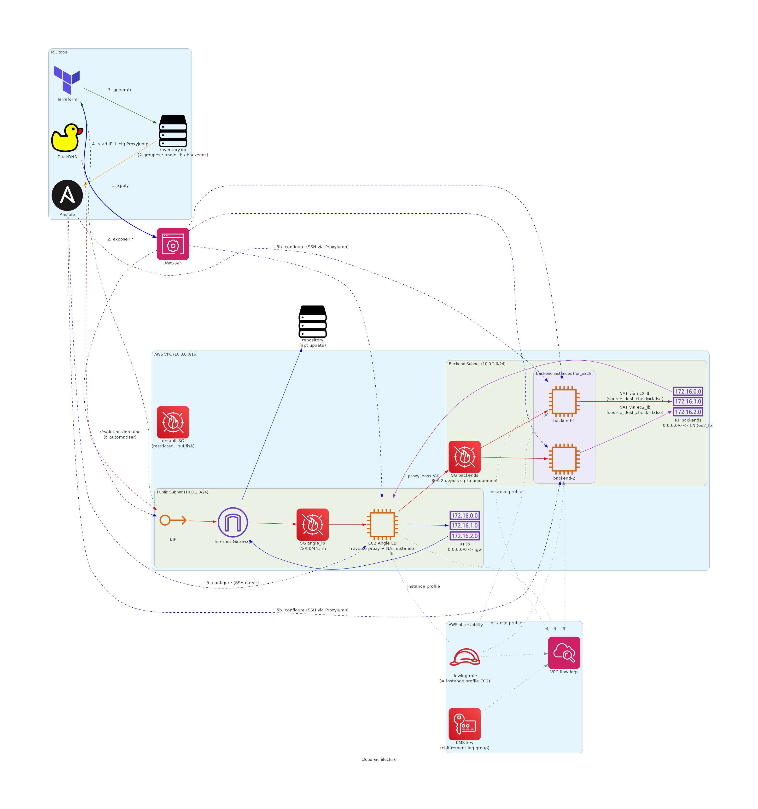

# Overview

Automated deployment of Wordpress related services using Terraform and Ansible

[](https://github.com/42-cloud/Cloud/actions)

[](https://github.com/42-cloud/Cloud/actions)


---

# Setup

## Prerequisites

All commands are compatible with Ubuntu

```bash
# Ensure local bin (or .local/bin) directory exists
mkdir -p $HOME/bin

# add taskfile
sh -c "$(curl -sSL https://taskfile.dev/install.sh)" -- -d -b $HOME/bin

# add terraform
TERRAFORM_VERSION="1.11.0"
curl -sSL "https://releases.hashicorp.com/terraform/${TERRAFORM_VERSION}/terraform_${TERRAFORM_VERSION}_linux_amd64.zip" -o /tmp/terraform.zip
unzip -q /tmp/terraform.zip -d $HOME/bin/
rm /tmp/terraform.zip

# add ansible
python3 -m venv $HOME/.ansible_venv
source $HOME/.ansible_venv/bin/activate
pip install --upgrade pip
pip install ansible-core
ln -sf $HOME/.ansible_venv/bin/ansible $HOME/bin/ansible
ln -sf $HOME/.ansible_venv/bin/ansible-playbook $HOME/bin/ansible-playbook
deactivate

# generate ansible vault password
openssl rand -base64 32  > .vault_pass_cloudone

# add other local analysis and linting dependencies
pip install checkov argcomplete

# add AWS CLI
curl "https://awscli.amazonaws.com/awscli-exe-linux-x86_64.zip" -o "awscliv2.zip"
unzip awscliv2.zip
./aws/install -i $HOME/.local/aws-cli -b $HOME/bin

# GET key details for AWS IAM profile
# AWS Management Console > IAM > Users > Create access key

# Configure AWS CLI
aws configure
# fill details from IAM

```

## Tasks

### all-in-one command
```bash
task deploy
```

### domain and terraform vars

Go on `duckdns.org`, choose an available custom subdomain (ex: `cloud1`).
Encrypt your duckdns token : 

```bash
ansible-vault encrypt_string \
  --vault-id=cloudone \
  --name 'global_duckdns_token' <DUCKDNS_TOKEN>
```

and replace the corresponding value in `ansible/group_vars/all/all.yml`

```bash
# create terraform/terraform.tfvars
task tf:tfvars
```

fill required inputs

### provisionning and configuration

```bash

# download providers
task tf:init

# check terraform project correctness
task tf:plan

# deploy infrastructure
task tf:apply

# deploy configuration
task ansible:play
```

Access the app on `https://cloud1.duckdns.org` (supposing you chose `cloud1`)

### check idempotency - replay a role or a group of tasks
Ansible report should reflect changed steps

```bash
# ex: after changing a post content, run the wp-content block
task ansible:tag TAG=wp_content
```

### check that db is not accessible from the internet

#### fom outside machine

```bash
# get public IP (or check in ansible inventory)
LB_IP=$(terraform output -raw angie_ip)

# scan network for mariadb port
nc -zv -w 3 $LB_IP 3306

# check if mariadb can execute with this IP (check credentials from ansible variables)
docker run --rm -it namichel/mariadb:12.3.2-amd64 mariadb \
  -h $LB_IP \
  -u wp_user \
  -p

```

#### from angie

```bash
# get public IP (or check in ansible inventory)
LB_IP=$(terraform output -raw angie_ip)

# connect to LB instance
ssh ubuntu@$LB_IP

# get private backend IP (or check ansible inventory)
BK_IP=$(terraform output -json instances_ips | jq -r '. | to_entries | map(select(.key != "'$(terraform json | jq -r '.lb_instance_name' 2>/dev/null || echo "node-1")'")) | .[0].value.private')

# scan network
nc -zv $BK_IP 3306
```

### check automated restart

```bash
# connect to the instance
ssh -i ~/.ssh/id_ed25519 -o "ProxyJump=ubuntu@<LB IP>" ubuntu@<instance IP>

# check that website is accessible -> should be 200
curl -I https://<subdomain>.duckdns.org

# restart remote host machine
sudo reboot

# wait for 45 sec
# check again that website is accessible -> should be 200
curl -I https://<subdomain>.duckdns.org

```

---

# Stack

[](https://www.terraform.io/)
[](https://www.ansible.com/)
[](https://taskfile.dev/)

[](https://aws.amazon.com/)
[](https://ubuntu.com/)

[](https://github.com/wolfi-dev/os)
[](https://github.com/chainguard-dev/apko)
[](https://github.com/chainguard-dev/melange)

[](https://github.com/ansible-community/molecule)
[](https://www.checkov.io/)
[](https://github.com/anchore/grype)

## Ubuntu as base OS

### package installation method

- DEB822 (from RFC 822) is the new APT norm to declare package repositories on Debian and Ubuntu. Successor to `.list`. 
  - it relies on key: value pairs for suites, components, architecture
  - every repo has its gpg key

## Automation and Orchestration

### Go-Task

> Task runner and build tool : an alternative to Makefile

- uses YAML
- handles cache more efficiently than Makefile : fingerprinting vs date of last modification
- multiplatform

### Bash script

`tfvars.sh` to check variables and generate `terraform.tfvars`

## Containerization

### Wolfi OS

> A secure Linux distribution

- used as a base layer for all services
- quickly updated in case of CVE
- compatible with packages compiled for glibc

### Melange

> Declarative APK builder : compiles packages from source code

- each service has its own `melange.yaml` build config
- packages are signed with a shared RSA key
- wolfi pipelines are fetched from `wolfi-dev/os` for test support

### Apko

> Image assembler : assembles packages into a _distroless_ image

- **secure** : images don't have shell, reducing attack surface
- **idempotent** : images are identical given the same inputs
- **lightweight** : single layer OCI image

Apko generates:
- SPDX SBOM with all components, licences, and upstream source commits for each package
- _SBOM_ (software bill of materials) which can be used to audit supply chain

UID and GID are `65532` : conventional ID for non-root

### melange-forge

> External library of statically compiled Go binaries for distroless images

- provides healthcheck binaries (`healthcheck-http`, `healthcheck-sql`, `healthcheck-fcgi`) embedded in each image
- replaces shell-based healthchecks (`curl`, `wget`, `mariadb-admin`) which are unavailable in distroless images
- `healthcheck-sql` uses `mlock` to prevent password from being swapped to disk
- passwords are read from files (tmpfs in prod) rather than environment variables
- source: [Kazibuya/melange-forge](https://github.com/Kazibuya/melange-forge)

### Images

| Service | Base | Tag |
|:--|:--|:--|
| Angie | Wolfi | `namichel/angie:1.11.6-amd64` |
| WordPress | Wolfi | `namichel/wordpress:7.0-amd64` |
| MariaDB | Wolfi | `namichel/mariadb:12.2.2-amd64` |
| phpMyAdmin | Wolfi | `namichel/phpmyadmin:5.2.3-amd64` |

## Infrastructure as Code

### Terraform

> An infrastructure as code tool that defines cloud resources

Key benefits :
- scaling : write one config file, run it for as many instances as needed
- idempotent : only applies steps that change the state
- configuration files can be versioned

#### Terraform basics

Terraform state is the source of truth for the deployment. It maps a declarative configuration (written in HCL) to real provider resources. It can detect _configuration drifts_ when the actual state of the cloud differs from the declared one.

__building blocks__
- `terraform {}` : define CLI version and external providers (here `hashicorp/aws` and `hashicorp/local`).
- `provider` : configure provider and instanciate region
- `resource` block : define various types of AWS components : `aws_instance`, `aws_vpc`, ..
- `data` block : fetch external information

__advanced logic__
- `for_each` : meta-argument that accept a map of a set of strings to generate multiple resources
- `depends_on` : force execution order between resources. Ex : ensure that ansible inventory is only generated once EC2 and EIP are created.

__variables__
Terraform uses variables stored in `terraform.tfvars`. Their type is defined in `variables.tf`. They are accessed with `var.myvar` syntax within the configuration.

- `outputs.tf` : define which info is displayed after deployment, and can be used by other tools (such as Ansible)

##### Hashicorp Configuration Language

```hcl
# ternary expresssions
vpc_security_group_ids = each.value == var.lb_instance_name ? [aws_security_group.angie_lb.id] : [aws_security_group.backends.id]

# for loops and list or map comprehensions
[for name, instance in aws_instance.cloudone : "${name} ansible_host=${instance.private_ip}"]
```

__builtin functions__

- `toset()` : convert a list of promitive values to a set
- `file()` : read and inject a local file content : used to load public ssh key
- `join()` : turn a string array into single string
- `concat()` : turn multiple lists into a single one
- `element()` : retrieve an intem at specified position
- `index()` : retrieve the position of specified item value
- `trimspace()` : clean strings

### Ansible

> Automation and configuration management tool

Key benefits
- agentless : contrary to Puppet, no need to deploy an agent. Ansible only requires a ssh connection and root access. It temporarily copies Python modules to run its operations
- idempotency : only applies tasks causing changes

#### Key parts of Ansible

- __inventory__ : script defining target hosts, ip addresses and groups. In this project, we use a dynamic inventory generated using Terraform. It defines two groups : public node `[angie_lb]` and private instances `[backends]
- __playbook__ : `site.yml` is the top-level orchestration file. Here, we reuse some roles and ensure that `angie_lb` is configured before the backend nodes.
- __roles__ allow to break down configuration into consistent and reusable components. Ex : `docker` role installs and launches a docker daemon.

#### Key concepts

- _idempotence_ : running the same configuration multiple times must result in the same system. i.e., contrary to running a script having `mkdir` which would create a new directory on every run, the same step in Ansible would only run if it is not present in the target state.
- _declarative_ code focuses on _what_ is the desired state. As opposed to _imperative_ code (i.e. a script focusing on _how_ to attain it)

#### Variables and scope

variables are resolved using a strict hierarchy with 22 priority levels (cf [details](https://blog.stephane-robert.info/docs/infra-as-code/gestion-de-configuration/ansible/ecrire-code/variables-facts/precedence-variables/))

| Category | Precedence | Usage |
|:--- |:-- |:-- |
|__role defaults__|1|variables that could be overriden by the user| 
|__group_vars/all.yml__|5| global values shared accross all host layers
|`--extra-vars`|22|max priority|

#### Ansible vault

Used for secrets, such as Duck DNS token or MariaDB passwords

#### Handlers

Special tasks that are triggered by using `notify`. Ex : reload Angie configuration

## Architecture evolution

We didn't have a definite idea of the target architecture when starting the project. It served as a sandbox to experiment with different approaches.

The architecture went through different phases:

```bash
[Internet] ---> [Elastic IP] ---> [EC2 Instance: Angie + WP + MariaDB]
```

- _instances_ : each computing instance is directly accessible. Security is ensured by rootless containerization, and by splitting docker networks between a web-accessible one, and another. We went on adding an elastic IP for each instance and mapping it to a DuckDNS domain. It seemed a good choice, but didn't allow to scale easily if we wanted to maintain the DuckDNS mapping, as there is a max limit of 5 subdomains per account.

```bash
[Internet] ---> [AWS ALB] ---> [Private Subnet: EC2 Instances (WP)]
                                      |---> [AWS KMS / CloudWatch Logs]
```

- _instances with Amazon load balancer_ : we added an instance of Amazon Load Balancer, which was aimed at being the only public access point, while instances IP would have been private. Yet, atop of being even-more provider-dependent and costly (billed by the hour), it increased the size and complexity of terraform state declaration, as we had to declare subnets, security groups, targets groups. Meanwhile, we had also added new AWS resources (IAM policies, KMS, logging) to patch potential security flaws highlighted by Checkov. 

- _instances with custom made load balancer_ : this implied having a separate instance with Angie as a load balancer. Network security is ensured at OS level by iptable configuration. Contrary to free version of Nginx, Angie handles ACME challenges, which also enabled us to get a LetsEncrypt certificate for the chosen subdomain. On the minus side, availability level is not the same as ALB, and scaling would require configuration modification through Ansible.



Would we have had more time to explore more in-depth cloud architecture, it could have been relevant to have 
- fully multitier instances with separate DBs (Amazon RDS)
- shared storage for WordPress uploads (Amazon EFS)
- duplication across availability zones
- isolate PhPMyAdmin on its own subnet and instance
- other services such as caching to improve performance.
- ...

### Which AWS resources are we declaring ?

|_name_|_description_|_terraform_|_AWS_|
|:--|:--|:--|:--|
| **AMI** | Pre-configured _Amazon Machine Image_ providing the base Ubuntu OS template. | `data.aws_ami` | [AWS AMI Docs](https://docs.aws.amazon.com/AWSEC2/latest/UserGuide/AMIs.html) |
| **EC2 Instance** | _Amazon Elastic Compute Cloud_ is a virtual compute server hosting the application, containers, and services. | `aws_instance` | [AWS EC2 Docs](https://aws.amazon.com/ec2/) |
| **KMS Key** | Centralized key managenent | `aws_kms_key` | [AWS KMS](https://aws.amazon.com/fr/kms/) |
| **EBS Block Store** | Persistent cloud storage volume attached to the instance acting as its root hard drive (`gp3`). | `root_block_device` | [AWS EBS Docs](https://aws.amazon.com/ebs/) |
| **Elastic IP (EIP)** | Static, persistent public IPv4 address assigned to ensure a fixed endpoint. | `aws_eip` | [AWS EIP Docs](https://docs.aws.amazon.com/AWSEC2/latest/UserGuide/elastic-ip-addresses-eip.html) |
| **VPC** | _Virtual Private Cloud_ : Isolated virtual private network space providing network boundary control. | `aws_vpc` | [AWS VPC Docs](https://aws.amazon.com/vpc/) |
| **Subnet** | A segmented logical partition inside the VPC network to group resources. | `aws_subnet` | [AWS Subnet Docs](https://docs.aws.amazon.com/vpc/latest/userguide/configure-subnets.html) |
| **Internet Gateway** | VPC component enabling bidirectional communication between the network and the public internet. | `aws_internet_gateway` | [AWS IGW Docs](https://docs.aws.amazon.com/vpc/latest/userguide/VPC_Internet_Gateway.html) |
| **Route Table** | Set of routing rules determining where network traffic from the subnets is directed. | `aws_route_table` | [AWS Route Table Docs](https://docs.aws.amazon.com/vpc/latest/userguide/VPC_Route_Tables.html) |
| **Security Group** | Virtual stateful firewall controlling permitted inbound and outbound traffic. | `aws_security_group` | [AWS SG Docs](https://docs.aws.amazon.com/vpc/latest/userguide/VPC_SecurityGroups.html) |
| **VPC Flow Logs** | Feature that captures IP traffic information flowing to and from network interfaces. | `aws_flow_log` | [AWS Flow Logs Docs](https://docs.aws.amazon.com/vpc/latest/userguide/flow-logs.html) |
| **CloudWatch Log Group** | Centralized log management and storage service repository for system monitoring data. | `aws_cloudwatch_log_group` | [AWS CloudWatch Logs Docs](https://aws.amazon.com/cloudwatch/) |
| **IAM Role** | Identity with specific permission policies determining what AWS resources can do. | `aws_iam_role` | [AWS IAM Roles Docs](https://docs.aws.amazon.com/IAM/latest/UserGuide/id_roles.html) |

#### Security

### Distroless images

All service images are built with apko from Wolfi packages: no shell, no package manager, minimal attack surface. Healthchecks use statically compiled Go binaries from [melange-forge](https://github.com/Kazibuya/melange-forge) instead of shell utilities.

### CVE comparison — official vs custom images

| Service | Official image | CVEs (C/H/M/L) | Custom image | CVEs (C/H/M/L) | Packages |
|:--|:--|:--|:--|:--|:--|
| **Angie** | `docker.angie.software/angie:1.11.6` | 256 (32/111/109/4) | `namichel/angie:1.11.6-amd64` | **0** | 366 → 15 |
| **WordPress** | `wordpress:6.9.4` | 923 (27/150/268/9) | `namichel/wordpress:6.9.4-amd64` | **0** | 273 → 36 |
| **MariaDB** | `mariadb:12.2.2` | 248 (3/37/171/34) | `namichel/mariadb:12.2.2-amd64` | **1\*** | 154 → 41 |
| **phpMyAdmin** | `phpmyadmin:5.2-apache` | 748 (23/131/218/11) | `namichel/phpmyadmin:5.2.3-amd64` | **0** | 284 → 118 |

> \* `CVE-2026-8376` in `perl` (Critical): no fix available upstream, low EPSS (< 0.1%). Perl is a transitive dependency of MariaDB and cannot be removed.

### SBOM

Each image build produces a signed SPDX SBOM via apko, tracking every installed package with its upstream source commit. SBOMs are committed alongside `apko.yaml` files under `melange/`.

### CVE Scanning

A GitHub Actions workflow runs on every push to `main`:

1. **syft** catalogs all packages including Composer/Go dependencies not visible to apko
2. **grype** scans the syft inventory against its CVE database
3. **issue-reporter** (from [melange-forge](https://github.com/Kazibuya/melange-forge)) formats findings as structured GitHub Issues with severity labels (`severity:critical`, `severity:high`, etc.)

### Known false positives & ignored CVEs

Two entries are intentionally ignored in `.grype.yaml` :

**`phpmyadmin` npm package**: grype matches a [known malicious npm package](https://github.com/advisories/GHSA-rpcf-p37j-wm4j) named `phpmyadmin` against our PHP application. These are unrelated — one is a malicious npm package, the other is the legitimate PHP web interface. Ignored by package name + type.

**`GO-2026-5024` in `gosu`**: this CVE affects `NewNTUnicodeString`, a Windows NT API. `gosu` runs exclusively on Linux where this code path is unreachable. Ignored by vulnerability ID + binary location (`/usr/bin/gosu`).

### Secrets

In local development, passwords are stored in `compose/secrets/` (gitignored) and mounted read-only into containers. In production (via Ansible), secrets are injected into a tmpfs mount, never written to disk. Both `docker-entrypoint.sh` scripts support `_FILE` environment variables natively for this purpose.

### Checkov

> Static analysis for Infra As Code

- compares code against security policies

## Services

### Angie

> Reverse proxy. Fork of nginx with extended features

- serves WordPress via FastCGI pass to php-fpm
- serves phpMyAdmin at `/phpmyadmin/`
- exposes status API at `/status/`
- exposes Prometheus metrics at `/metrics/` (in local deploy)

### Wordpress

> An open source CMS

NB : There is no official Ansible module for Wordpress management. Partly because cli evolves too fast and should be compatible with many php versions.

### MariaDB

> An open source fork of MySQL

### PHPMyAdmin

> An administration tool for DB

## Network

### Duck DNS

> A DNS provider

 - we should reestabish mapping every time the infrastructure is redeployed (AWS generates a new public Elastic IP)

---

# Resources

| Url                   | Kind   | Notes                  |
| :------------------------- | :----- | :--------------------- |
| [Terraform doc](https://developer.hashicorp.com/terraform/docs) | 📔 | |
| [Ansible doc](https://docs.ansible.com/) | 📔 | |
| [Taskfile doc](https://taskfile.dev/docs/guide) | 📔 | |
| [Chainguard doc](https://edu.chainguard.dev/) | 📔 | for Melange and Apko |
| [melange-forge](https://github.com/Kazibuya/melange-forge) | 🌐 | Go binaries for distroless images |
| [Wolfi OS](https://github.com/wolfi-dev/os) | 🌐 | Package repository |
| [Syft](https://github.com/anchore/syft) | 🌐 | SBOM and package cataloging |
| [Grype](https://github.com/anchore/grype) | 🌐 | CVE scanner |
| [Automating IT with Ansible](https://www.educative.io/courses/automating-it-infrastructure-with-ansible) | 📘 | |
| [Infra as Code using Terraform](https://www.educative.io/courses/infrastructure-as-code-using-terraform) | 📘 | |
| [Stephane Robert](https://blog.stephane-robert.info/docs/infra-as-code/gestion-de-configuration/ansible/) | 📘 | Excellent tutorials |
| [Installing WP with Ansible](https://oneuptime.com/blog/post/2026-02-21-ansible-deploy-wordpress-site/view) | 📘 | Tutorial using MySQL setup, PHP-FPM, Nginx, wp-cli. ⚠️ Not the same containerized approach yet useful for wp cli steps |

Resource type

 - 📔 official doc
 - 📘 course
 - 🗒️ cheatsheet, synthesis
 - 🌐 web, article
 - 📽️ video

## AI Usage

| Goal                   | Tool   |
| :--------------------- | :----- |
| **Senior guidance** : we submit an approach, the AI suggests alternative implementations with their tradeoffs. | LLM Chatbot (Gemini, Claude) |
| **Documentation / Crash course** : we ask for a recap over a tools or part of its features. | LLM Chatbot (Gemini, Claude) |
| **Boilerplate code** : we asked to generate parts of the code, that were not in the immediate scope of the project and/or once we reckoned we would have been able to do it by ourselves : useed for `tfvars.sh` script | LLM Chatbot (Gemini, Claude) |
| **Debugging help** : sometimes direct questions (why does this occur + console log as a context). Many times. But as we got a better mastery of the concepts and tools, we tried to prompt the AI to provide methods and heuristics instead | LLM Chatbot / CLI (Gemini) |
| **PR Review** : early check of potential bugs | Github Copilot | 

We didn't take time to provide a recurrent context for this project, although the quality and rapidity of AI inputs could have largely benefitted from it.

We used a browser extension (PiiBlocker) to prevent leaking personal information.

---

# Challenges met and lessons learned

The subject provided by 42 holds within 1 page. The goal is simple : at first glance, we _merely_ have to automate the deployment of the Inception project, which is part of common core. Yet it is easy to turn it into something bigger than expected:

## DevSecOps paradigm can always be pushed further
Rather than pulling standard and potentially vulnerable official Docker image, we chose, driven by namichel appetence for those tools, to dive into supply-chain security.
We included a series of tools from **Chainguard / Wolfi OS** ecosystem to generate ad hoc images for the project. This also implied rewriting healthchecks (as we could not rely any more on bundled shells), defining new packages, ...

## Ansible variable matrix
The 22 priority levels, combined with the necessity to override some of the variables for molecule tests and some design good practices (prefixing variables with the role name, a good way to ensure roles are independant), led to a certain level of complexity, which has not been entirely flattened yet.

## Idempotence vs automation efficiency
Maintaining pure idempotence and relying on ansible modules (although there are more than 3000 of them) proved difficult, especially for wordpress configuration tasks. As no official wordpress CLI module is available, we could only run ansible.builtin.shell tasks, manually determining the change condition

## Cloud architecture rigor
We went on with many adjustments with the cloud architecture (cf. supra). We realized that operating a real cloud environment meant finding best tradeoffs between security best practices (mostly highlighted by Checkov), operational costs and performance.

## Technical debt : what could be improved

Not exhaustive..

### Code quality and architcture
- playbook modularization
- variable naming and inheritance consistency

### Security and hardening
- modern ansible modules : identify tasks that could make use of idiomatic modules like `ansible.builtin.slurp`

### Observability
- integrate Prometheus / Grafana in the deployed configuration. Drawback : might require running bigger instances.

### Testing
- advanced IaC testing : use true integration testing frameworks such as __Terratest__, which could spare the project of the complexity introduced by attempting to check docker deployments within molecule docker instances.
